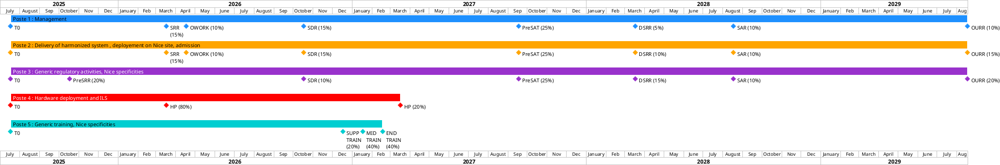

```plantuml
@startgantt

project starts at 2025-07-01

projectscale monthly zoom 1.3


[Poste 1 : Management] as [tf_p1] starts at 2025-07-17 and ends at 2029-08-17 and is colored in dodgerblue
[T0] as [tf_p1_t0] happens 2025-07-17 and is colored in dodgerblue
[SRR\n(15%)] as [tf_p1_srr] happens 2026-03-17 and is colored in dodgerblue and displays on same row as [tf_p1_t0]
[OWORK (10%)] as [tf_p1_owork] happens 2026-04-17 and is colored in dodgerblue and displays on same row as [tf_p1_t0]
[SDR (15%)] as [tf_p1_sdr] happens 2026-10-17 and is colored in dodgerblue and displays on same row as [tf_p1_t0]
[PreSAT (25%)] as [tf_p1_presat] happens 2027-09-17 and is colored in dodgerblue and displays on same row as [tf_p1_t0]
[DSRR (5%)] as [tf_p1_dsrr] happens 2028-03-17 and is colored in dodgerblue and displays on same row as [tf_p1_t0]
[SAR (10%)] as [tf_p1_sar] happens 2028-08-17 and is colored in dodgerblue and displays on same row as [tf_p1_t0]
[OURR (10%)] as [tf_p1_ourr] happens 2029-08-17 and is colored in dodgerblue and displays on same row as [tf_p1_t0]
[ ] as [b1] happens 2025-07-17 and is colored in white

[Poste 2 : Delivery of harmonized system , deployement on Nice site, admission] as [tf_p2] starts at 2025-07-17 and ends at 2029-08-17 and is colored in orange
[T0] as [tf_p2_t0] happens 2025-07-17 and is colored in orange
[SRR\n(15%)] as [tf_p2_srr] happens 2026-03-17 and is colored in orange and displays on same row as [tf_p2_t0]
[OWORK (10%)] as [tf_p2_owork] happens 2026-04-17 and is colored in orange and displays on same row as [tf_p2_t0]
[SDR (15%)] as [tf_p2_sdr] happens 2026-10-17 and is colored in orange and displays on same row as [tf_p2_t0]
[PreSAT (25%)] as [tf_p2_presat] happens 2027-09-17 and is colored in orange and displays on same row as [tf_p2_t0]
[DSRR (10%)] as [tf_p2_dsrr] happens 2028-03-17 and is colored in orange and displays on same row as [tf_p2_t0]
[SAR (10%)] as [tf_p2_sar] happens 2028-08-17 and is colored in orange and displays on same row as [tf_p2_t0]
[OURR (15%)] as [tf_p2_ourr] happens 2029-08-17 and is colored in orange and displays on same row as [tf_p2_t0]
[ ] as [b2] happens 2025-07-17 and is colored in white

[<font color="white">Poste 3 : Generic regulatory activities, Nice specificities] as [tf_p3] starts at 2025-07-17 and ends at 2029-08-17 and is colored in darkorchid
[T0] as [tf_p3_t0] happens 2025-07-17 and is colored in darkorchid
[PreSRR (20%)] as [tf_p3_presrr] happens 2025-10-17 and is colored in darkorchid and displays on same row as [tf_p3_t0]
[SDR (10%)] as [tf_p3_sdr] happens 2026-10-17 and is colored in darkorchid and displays on same row as [tf_p3_t0]
[PreSAT (25%)] as [tf_p3_presat] happens 2027-09-17 and is colored in darkorchid and displays on same row as [tf_p3_t0]
[DSRR (15%)] as [tf_p3_dsrr] happens 2028-03-17 and is colored in darkorchid and displays on same row as [tf_p3_t0]
[SAR (10%)] as [tf_p3_sar] happens 2028-08-17 and is colored in darkorchid and displays on same row as [tf_p3_t0]
[OURR (20%)] as [tf_p3_ourr] happens 2029-08-17 and is colored in darkorchid and displays on same row as [tf_p3_t0]
[ ] as [b3] happens 2025-07-17 and is colored in white

[<font color="white">Poste 4 : Hardware deployment and ILS] as [tf_p4] starts at 2025-07-17 and ends at 2027-03-17 and is colored in red
[T0] as [tf_p4_t0] happens 2025-07-17 and is colored in red
[HP (80%)] as [tf_p4_hp] happens 2026-03-17 and is colored in red and displays on same row as [tf_p4_t0]
[HP (20%)] as [tf_p4_hd] happens 2027-03-17 and is colored in red and displays on same row as [tf_p4_t0]
[ ] as [b4] happens 2025-07-17 and is colored in white

[Poste 5 : Generic training, Nice specificities] as [tf_p5] starts at 2025-07-17 and ends at 2027-02-17 and is colored in darkturquoise
[T0] as [tf_p5_t0] happens 2025-07-17 and is colored in darkturquoise
[SUPP\nTRAIN\n(20%)] as [tf_p5_supp_train] happens 2026-12-17 and is colored in darkturquoise and displays on same row as [tf_p5_t0]
[MID\nTRAIN\n(40%)] as [tf_p5_mid_train] happens 2027-01-17 and is colored in darkturquoise and displays on same row as [tf_p5_t0]
[END\nTRAIN\n(40%)] as [tf_p5_end_train] happens 2027-02-17 and is colored in darkturquoise and displays on same row as [tf_p5_t0]

@endgantt
```

